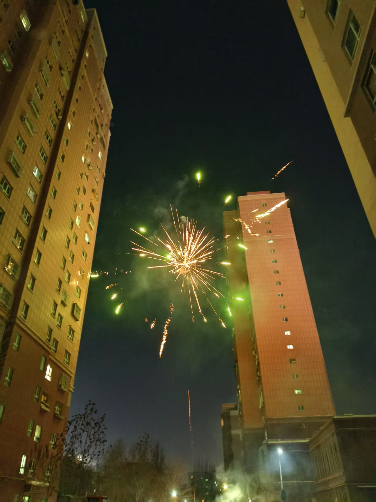
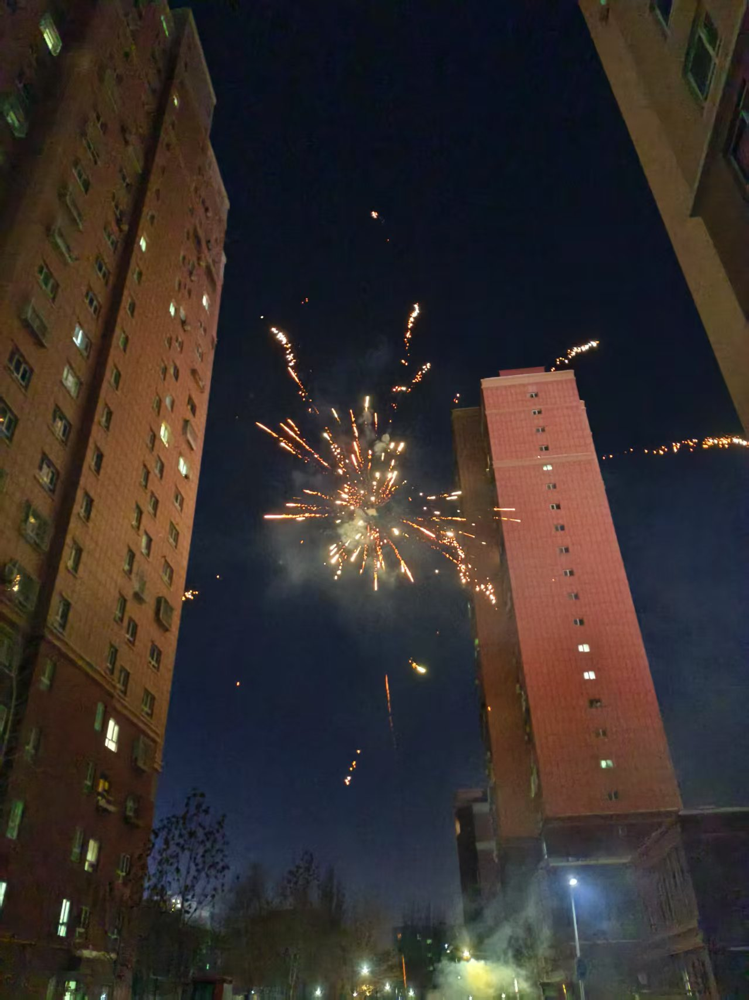

### 1st
- the fireworks that last householder left for us, I fired some of them and took photos, they are beautiful
- the birthday cake bought from Mr Brown and fine tableware
- Detective Chinatown 1900 was worthy to watch

### 2nd
- I watched a wonderful fireworks show while I went home after tutor course
- I saw the new moon came out after disappearing for some days
- Mom cooked delicious soup this afternoon

### 3rd
- Nezha: The Devil Boy's Havoc in the Sea is really interesting and watchworthy, the cinema is full of people. It's peak season of films.
- talked about recent things with Fu Can is a good experiment
- Fu Can took me to home after eating beef noodles

### 4th
- Li Mengyuan got 92 scores in today's simulated math exam, 49 scores more than last exam
- Mom made a simple and delicious noodles this noon
- Read Gu Cheng's academic masterpiece Nan Ming Shi was a peculiar experience for me

### 5th
- I went to the hospital, visited the doctor, charged the bill, took my medicine and reserved the surgery smoothly
- mom cooked mixed noodles and it's delicious
- some colleagues asked me to do some work, but they agreed to delay it after knowing that I'm on vacation

### 6th
- I bought a bottle of plum wine, and the boss give me 5 Yuan's discount
- I knew that happiness is not being happy all the time and never felt negtive emotions from Tal Ben Shahar's book
- Boluoyou prince's videos about virtual Ming Dynasty

### 7th
- I found that exercise can wake up my body in the morning
- A doctor gave me a mask after the surgery
- I cancelled the courses in today and tomorrow because of the surgery, and my students's mothers all agreed

### 8th
- Boluoyou prince's videos were really interesting, and I wanted to play eu4 too
- I downloaded a free version of eu4 with all dlcs from a QQ group
- Mom cooked meals with no pepper and other stimulating ingredients for me

### 9th
- Mom helped me wash hair to prevent my wound from water
- Mom and my brother helped me change the dressing on the wound
- Mom made kang-baked pancake for me

### 10th
- all flower buds have blossomed

- the fireworks after tutoring course

- mom cooked special meal for me

### 11th
- Taking a meditation when I was bathing in the sunlight was very comfortable
- Today's rice was really delicious
- My little brother bought two new patches for the wound

### 12th
- The fireworks were really beautiful
- I felt Titanic was a great movie when I watched it again today
- I found that delicacy is important for me because I can't eat spicy food these days

### 13th
> 今天我决定把写日记改为用汉字，因为英语经常没法准确描述真实的情况，把用当天学过的单词造句单独做为另一项任务。

- 今天的冥想格外有效，冥想之后感觉全身舒适，内心轻松
- 妈妈炒的豆角炒肉和米饭都特别香
- 丁涟峰帮我洗头，洗得挺认真的

### 14th
- 霸王茶姬-玫瑰丛中奶茶。没想到王佳妮会给我和邱树欣点这么昂贵的奶茶，味道很不错，很感谢她。
- 工资到账4797元。虽然年终奖还没发，但是工资提前一天发了，这是本月第一笔收入；据说后面工资会涨500，而且会把这两个月的也补上，希望下个月就会发下来！
- 补课。郭润宁妈妈和张佳宁妈妈都同意明天上课。
- 一些小玩意。包括一个取碗器、肥皂盒和压蒜器，都很实用同时价格很便宜，感谢这个时代的生产力。

### 15th
- 高德地图。没有高德地图，今天我要在医学院里转一天。
- 丁涟峰再次帮我洗头。今天虽然拆线了，但是还是不能碰水。
- 延迟分班。丁涟峰开学暂时不分班，这样就又有一个学期可以弥补前面拉下的内容，本来以他之前几次考试的成绩可能会掉到平行班，现在只要继续努力，至少留下是没问题了。

### 16th
- 新疆美术馆。里面有很多雕塑和画，有一副油画跟照片特别像。

- 拉条子。时隔3天，再一次吃到妈妈做的饭。
- 一颗不知道什么品种的树，很好看

### 17th
- 理财。刚才仔细整理了我所有的存款和基金，一共463763.15元，预计5月底就能达到50万。按照3%的年化利率来说，每天的利息有38.05元，也就是说每天花不到这么多钱，拿这笔钱我永远也花不完！！
- 遗嘱。这件事几年前我就想做了，但是一直没有下定决心，今天终于抽空完成了。它让我明白了，在我心里什么才是最重要的。立完遗嘱后，我感觉内心轻松了不少，好像放下了一块大石头。
- AI狼人杀。现在的AI太强大了，尤其是deepseek r1，在狼人杀的表现中堪称可怕，它的逻辑有时候我甚至看不懂，有点震撼。
- 饺子。妈妈做了白菜猪肉的饺子，好久没吃了，感觉很好吃。
- 夕阳余晖。下班回家路上看到了最后一抹夕阳，在树枝与楼房的缝隙中间，显得特别明亮。

> 李梦媛以后周内只在周一和周三上课了，我得想想空出来的时间做什么，是再接个学生，还是考虑一下其他工作。

### 18th
- 《善意的竞争》漫画。不知不觉看了一上午，主要讲的是韩国高中生变态的学习内卷和竞争，跟中国差别很大。
- 迎着太阳做冥想。感觉不仅内心更平静，眼睛也舒服了很多。
- 饺子。妈妈昨天包了很多饺子，有白菜肉和芹菜肉两种馅，都很好吃，可惜还不能吃辣子和蒜，不然会更美味。
- 午睡。午睡之后，浑身舒坦。
- 地图。在网上找到了6大洲的免费高清地图。

### 19th
- 午睡。
- 秦少爷的炸酱面。时隔多日，终于可以再次吃辣，感觉太棒了。
- 《一品布衣》漫画。很有意思，金手指也不多。

### 20th
- 冥想。闭着眼睛对着太阳冥想比一般的冥想效果要更好。
- 午睡。
- 《一品布衣》漫画。
- 饺子。妈妈提前包了很多饺子，够我和弟弟们吃好几顿。

### 21th
- 冥想。今天第一次冥想被电话打断，接完电话又做了一次，感觉挺好。
- 午睡。今天李雪来了，感觉她也想下去午睡，但是我有点累，所以没跟她客气，躺在床上又觉得这样不太好，下次还是把床让给她们女生吧。
- 《我的智障系统》。最近看这种熊猫人动漫有点上头，不过从早到晚看这个也不好，今天早上连锻炼和背单词都没有做。

### 22th
- 《我的宝物都是规则系》。这个漫画太搞笑了。
- 凡人修仙传最新更新。韩立马上要得到风雷翅了，凡人最爽的部分之一。
- 8点半的自助打印机。挺方便的，而且价格也不高，比之前的打印店好多了。

### 23th
- 午餐。自从年前妈妈做的一顿鸡汤后，现在感觉她做的每一顿饭都很好吃。
- 家教课。单欣俞同意在我这里补课，而且一周要上两节，我要想想怎么给她排课。
- 修真界泥石流。这个小说是《我的宝物都是规则系》动漫的原版，很有意思，我看了一天，有点上头。

### 24th
- 冥想。
- 午睡。
- 修真界泥石流。这小说还有俩名字，一个是修真界第一混乱，还有一个是我的法宝都是规则系，今天在网上搜了半天。
- 我的第一本人生规划手册。今天在Z站找到了这本书的资源，感谢Z站以及无私上传的人。
