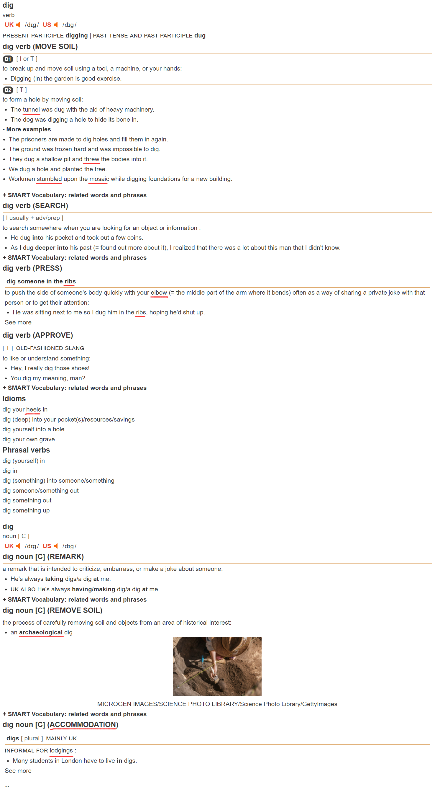
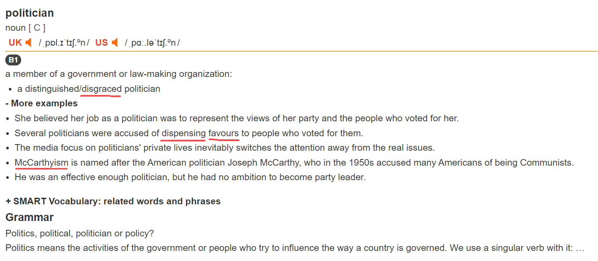
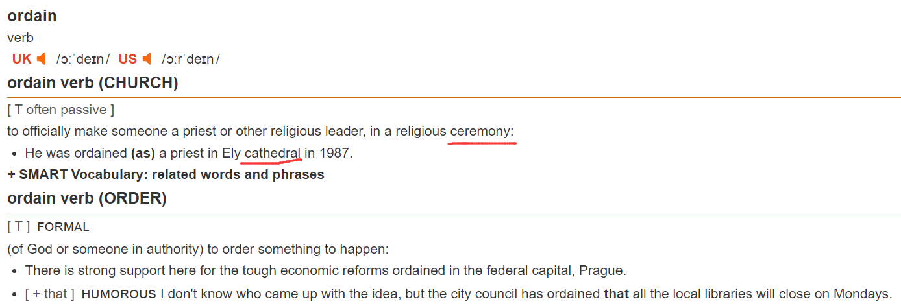
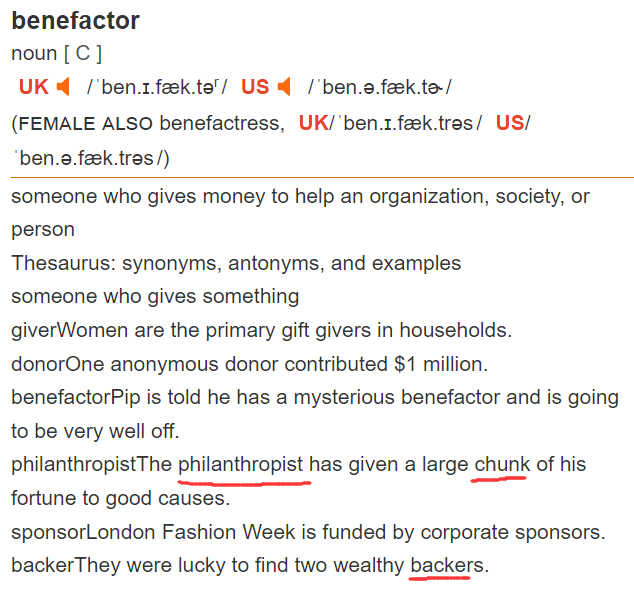
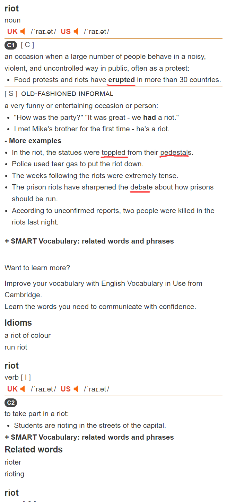
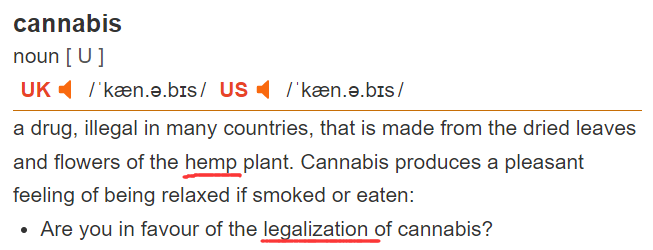
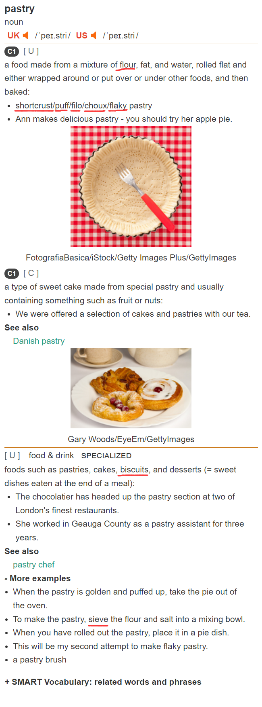
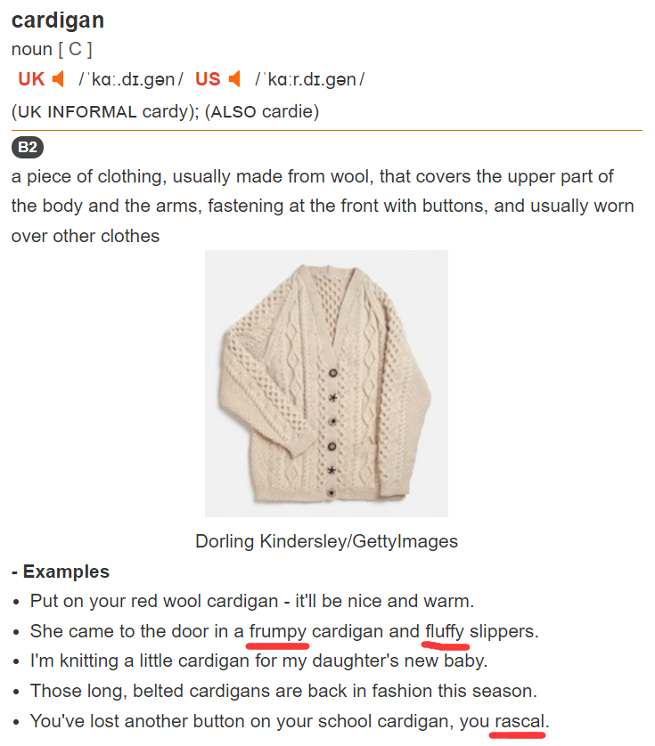
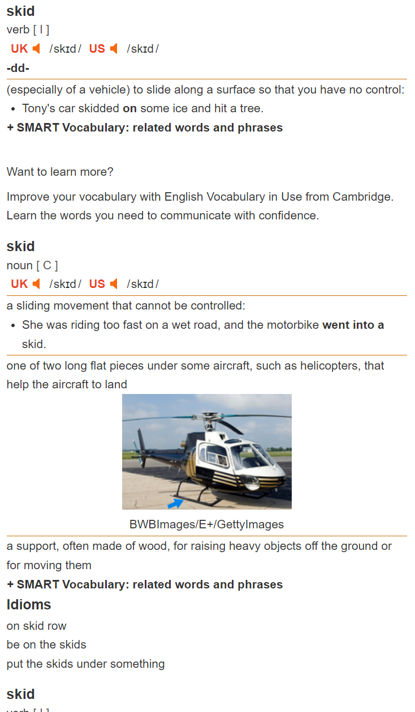

# September

## 18th
### 1. client

### 2. cognitive

### 3. conscious

### 4. aerobic

### 5. enterococci

### 6. streptococcus

### 7. bacterium

### 8. unicellular

### 9. algae

### 10. acquatic

### 11. seaweed

### 12. chlorophyll

### 13. pigment

## 19th
### 1. tissue

### 2. scar

### 3. heal

### 4. rift

### 5. tear

### 6. belt

### 7. strip

### 8. bark

### 9. bite

### 10. fingernail

## 20th
### 1. dig

### 2. tunnel

### 3. rugby

### 4. touchline

### 5. hamstring

### 6. tendon

### 7. thign

### 8. strained

### 9. preseason

### 10. Manchester

### 11. arsenal

### 12. ache

### 13. dull

### 14. respectable

### 15. suburb

### 16. middle-class

### 17. accountant

### 18. squash

### 19. flat

## 21th
### 1. pastry

### 2. flour

### 3. grain

### 4. grass

### 5. glisten

### 6. dew

### 7. strum

### 8. shady

### 9. picnic

### 10. hamper

### 11. lawn

### 12. mow

## 22th
### 1. wheat

### 2. yellowish

### 3. staple

### 4. phosphate

### 5. phosphorus

### 6. mutton

### 7. nitrogen

### 8. diversify

### 9. ripen

### 10. ripe

### 11. crop

### 12. bamper

### 13. vehicle

### 14. overturn

### 15 skid

## 23th
### 1. intruder

### 2. rioter

### 3. alight

### 4. blanket

### 5. wool

### 6. cardigan

### 7. frumpy

### 8. fluffy

### 9. politician

### 10. cardinal

### 11. catholic

### 12. lapsed

## 25th
### 1. priest

### 2. ordain

### 3. ceremony

### 4. climax

### 5. spectacular

### 6. drape

### 7. coffin

### 8. velvet

### 9. cusion

### 10. lean

## 26th
### 1. scrawny

### 2. slim

### 3. hip

### 4. ball-and-socket

### 5. socket

### 6. lighter

### 7. barge

### 8. cargo

### 9. spill

### 10. funnel

## 27th
### 1. grind

### 2. pepper

### 3. peppercorn

### 4. spicy

### 5. jazzed

### 6. thrilled

### 7. pumped

### 8. exhilarated

### 9. overexcited

### 10. absurdly

### 11. lottery

### 12. charity

## 28th
### 1. anonymous

### 2. benefactor

### 3. philanthropist

### 4. giver

### 5. bribe

### 6. shoddy

### 7. workmanship

### 8. inextricably

### 9. welfare

### 10. sommon

## 29th
### 1. reforcement

### 2. council

### 3. deaf

### 4. dumb

### 5. copper

### 6. shine

### 7. torch

### 8. riot

### 9. erupt

### 10. volcano

## 30th
### 1. dormant

### 2. electoral

### 3. defeat

### 4. vanquish

### 5. annihilate

### 6. hammer

### 7. thumb

### 8. nip

### 9. hamster

### 10. bud

# October
## 2nd
### 1. cannabis

### 2. hemp

### 3. rope

### 4. ashore

### 5. coil

### 6. bun

### 7. cinnamon

### 8. tropical

### 9. tropics

### 10. equator

## 3rd
### 1. eradicate

### 2. basin

### 3. pudding

### 4. pastry

### 5. shortcrust pastry

### 6. puff

### 7. chimney

### 8. belch

### 9. dense

### 10. undergrowth

## 4th
### 1. foliage

### 2. impenetrable

### 3. farthest

### 4. landmark

### 5. treaty

### 6. emission

### 7. stablize

### 8. sulphur

### 9. reek

### 10. hipocrisy

## 5th
### 1. steel

### 2. girder

### 3. rod

### 4. pole

### 5. totem

### 6. lash

### 7. cable

### 8. deafening

### 9. missile

### 10. manoeuvrable

## 6th
### 1. devastating

### 2. drought

### 3. obliterate

### 4. stronghold

### 5. pesticide

### 6. spray

### 7. polish

### 8. wit

### 9. coruscating

### 10. laconic

## 7th
### 1. generosity

### 2. conditioner

### 3. nasal

### 4. congestion

### 5. chest

### 6. waist

### 7. rib

### 8. jab

### 9. syringe

### 10. knit

## 9th
### 1. wool

### 2. cardigan

### 3. fluffy

### 4. lipstick

### 5. itch

### 6. lump

### 7. custard

### 8. swelling

### 9. frumpy

### 10. rascal

## 10th
### 1. pullover

### 2. weave

### 3. loom

### 4. slender

### 5. volcanic

### 6. ash

### 7. cliff

### 8. skid

### 9. plunge

### 10. pea

## 11th
### 1. faint

### 2. lamp

### 3. infrared

### 4. polit

### 5. bomber

### 6. devastation

### 7. recollection

### 8. malfunction

### 9. cosmetic

### 10. toiletries

### 11. shampoo

## 12th
> 从今天开始改用 www.vocabulary.com 查词
