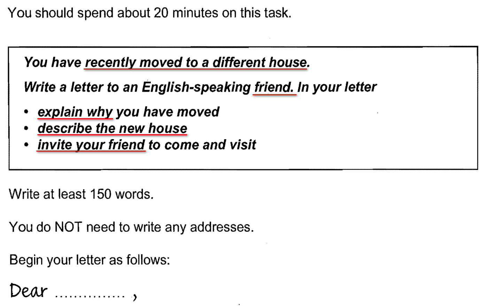

# 2023-08-11
## G8-A-1 

### My origin article
> Dear Anna,
> I hope this letter finds you well. I want to tell you that I have moved to a new house last week.
> It was so far between my former house and my company. I had to cost much time on traffic. Sometimes, I was late for work because I got up just a little more later than normal day. So I found a new house which is closer to my work place.
> My current house locates by the Baihu road, it only takes 10 minutes when I go to work. From my bedroom, I can see the beautiful White Birds Lake. I always walk along the bank in the evening after dinner, there are many people selling snacks, fruits and sometimes toys. It's very interesting.
> I'm really looking forward to catching up with you, especially as we haven't had a proper chat for such a long time. I hope you can come here and visit my house soon. I can introduce you many very delicious food and we can talk to each other about our recent situations.
> See you then!
> Dean

### AI score: 6.5
- Task Completion (6/9)
    > The writer has successfully completed the task by explaining why they moved, describing their new house, and inviting their friend to come and visit. However, the description of the new house could have been more detailed.

- Coherence and Cohesion (7/9)
    > The letter is well-organized and easy to follow. The ideas are connected and the transitions between paragraphs are smooth. However, there are some minor issues with coherence, such as the use of “much time” instead of “a lot of time”.

- Vocabulary (7/9)
    > The writer uses a good range of vocabulary and there are some nice phrases such as “cost much time on traffic” and “walk along the bank”. However, there are some minor errors such as “a little more later” instead of “a little later”.

- Grammar (6/9)
    > The writer demonstrates a good control of grammar, but there are some errors such as “I had to cost much time on traffic” instead of “I had to spend a lot of time in traffic” and “I was late for work because I got up just a little more later than normal day” instead of “I was late for work because I got up just a little later than usual”.

### AI's 9 points model essay
> Dear Anna,
> I hope this letter finds you well. I am writing to let you know that I have recently moved to a new house. The main reason for my move was the long commute from my previous home to my workplace. I often found myself spending hours in traffic and even being late for work on occasion.
> My new house is located on Baihu Road, just a short 10-minute drive from my office. It is a beautiful two-story building with spacious rooms and large windows that offer stunning views of White Birds Lake. In the evenings, I enjoy taking leisurely walks along the lake’s shore, where vendors sell all sorts of delicious snacks and trinkets.
> I would love for you to come and visit me in my new home. We could catch up on old times and explore the local area together. There are so many interesting sights to see and delicious foods to try.
> Looking forward to seeing you soon!
> Best regards,
> Dean