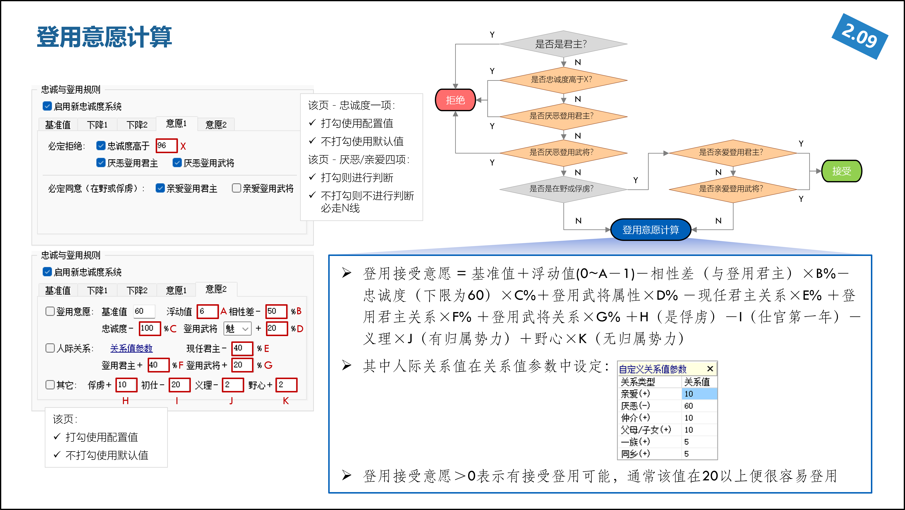

1、基准值：60（默认），代表初始获得60点接受登用意愿
2、忠诚度：系数为-100%（默认），意为1点忠诚度减去1点登用意愿（忠诚度小于60按60计算，在野武将忠诚度默认为60）
3、相性差：系数为-50%（默认），计算被登用人员与登用方君主的相性差，每2点相性差减去1点登用意愿，如果相性差为20，就减去10点
4、登用武将魅力，系数为+20%（默认），每5点登用武将的魅力，加1点登用意愿，100魅力获得20点登用意愿
5、3种人际关系（与现任君主，与登用方君主，与登用武将）
每1项关系的计算方法一致：亲爱+10，厌恶-60，一族+5，结义/结婚+10，父母/子女+10，同乡+5
现任君主的系数是-40%，即如果被登用武将和现任君主的关系分为20（父母+一族+同乡），则减去8点登用意愿
登用君主的系数是+40%，即如果被登用武将和登用君主的关系分为10（假设亲爱），则加上4点登用意愿
登用武将的系数是+20%，即如果被登用武将和登用武将的关系分为5（假设同乡），则加上1点登用意愿
6、如果是俘虏（无论是无归属还是有归属势力），登用意愿+10点
7、如果该武将是出仕的第一年（可以查仕龄是不是为1），则登用意愿-20点【很多人说60点忠都登不到，就是因为这个】
8、如果该武将是有归属势力状态，则每一点义理再减去2点（默认）意愿
而如果该武将是无归属势力即在野状态，则不看义理，看野心，每一点野心加2点（默认）意愿
义理和野心的取值范围都是0-4，所以有归属势力状态最多减去8点意愿，无归属势力最多加上8点意愿
9、浮动值：6（默认），意味着在0~5之间取一个随机值，登用意愿再加上这个随机值，该随机值是根据登用武将id、被登用武将id、登用当前旬number决定的一个伪随机数，SL不会改变这个随机数。

> 拿昨天猪猪登不到李存孝来举例，根据现在常规难度的配置，登用基准值是65，魅力系数是25%，其它都默认，则仕龄为1的李存孝，就算忠诚度下降到60，由于他和苻洪有38点相性差，加上仕官第一年要减20点，最终的意愿是-7.5%~-2.5%（按90魅无特殊关系的登用武将计算），肯定是登不了的。

> 但是如果不是仕官第一年，则李存孝忠诚度75的时候，就有-2.5%~2.5%的登用意愿（按90魅无特殊关系的登用武将计算），这时候就已经有登用可能了。

最后说一下登用意愿是怎么转换成登用成功概率的，先说结论，只要登用意愿大于20，就属于非常好登了。
再说为什么，以下需要一丢丢概率论的知识：
- 登用意愿 = 一次登用是否成功的概率
即如果你只有一个魅力90的武将，登用60忠的李存孝的意愿是15%，那么当前成功概率就是15%（当然成功与否也是根据登用武将id、登用当前旬number决定的一个伪随机数，SL不会改变这个随机数）
但是，如果你有5个魅力90的武将，那么任意一人登用成功的概率是多少呢？
没错，就是100%-（100%-15%）^5 = 56%
如果你有10个魅力90的武将呢？
就是100%-（100%-15%）^10 = 80%
这就是我说为什么20点登用意愿其实成功率已经很高的道理，甚至说就登用意愿高于5，几个回合之内是一定会命中登用成功的。
